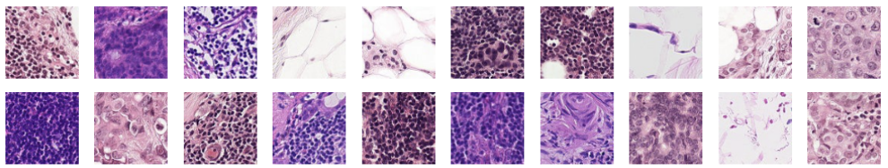

## Histopathologic Cancer Detection

Identificando o tecido metastático em exames histopatológicos de seções de linfonodos

Neste problema de negócio, vamos criar um algoritmo para identificar o câncer metastático em pequenas manchas de imagem tiradas de varreduras de patologia digital. Os dados para esta competição são uma versão ligeiramente modificada do conjunto de dados de benchmark PatchCamelyon (PCam).

Essa é uma competição oriunda do Kaggle, e pode ser encontrada nesse [link](https://www.kaggle.com/c/histopathologic-cancer-detection).

## Data

Neste conjunto de dados, você recebe um grande número de pequenas imagens de patologia para classificar. Os arquivos são nomeados com um ID de imagem. O arquivo `train_labels.csv` fornece os true labels para as imagens na pasta train.

A pasta teste contém as imagens que você irá utilizar para avaliar seu modelo. **Um rótulo positivo indica que a região central de 32x32px de um patch contém pelo menos um pixel de tecido tumoral**.

### Tamanho

Os dados possuem aproximadamente 8Gb de tamanho, são mais de 200k de imagens e o download pode ser feito pela aba `Data` no site do kaggle que foi indicado acima.

Como tamanha quantidade de dados não são versionados no github, nesse vídeo abaixo eu ensino a configurar o **DVC + Google Drive** para versionar os seus dados e conseguir continuar usando o github para versionar o código do projeto.

- [Como utilizar o DVC para versionamento de dados](https://www.youtube.com/watch?v=kuICHbwtkKI):
  
